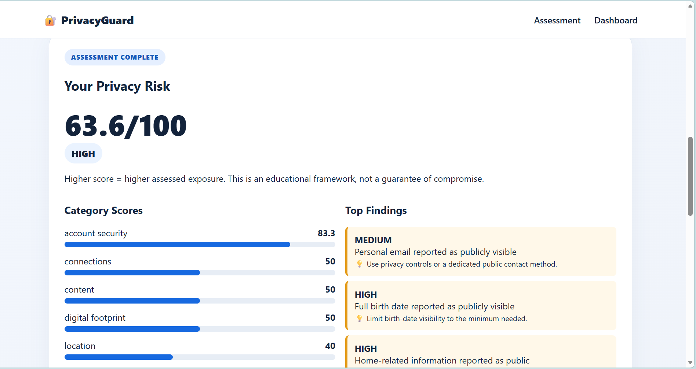
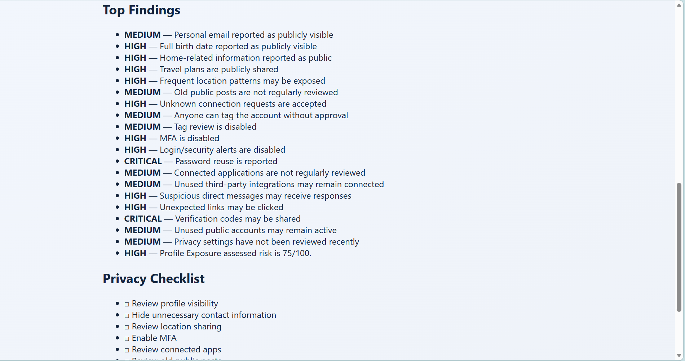
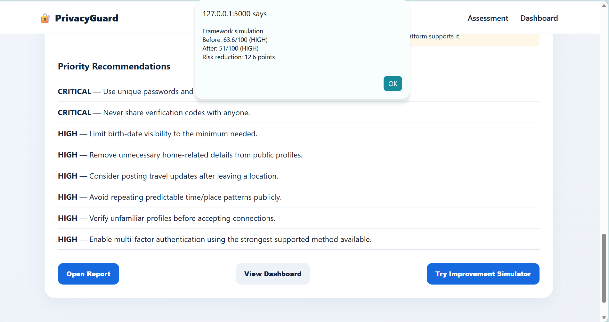
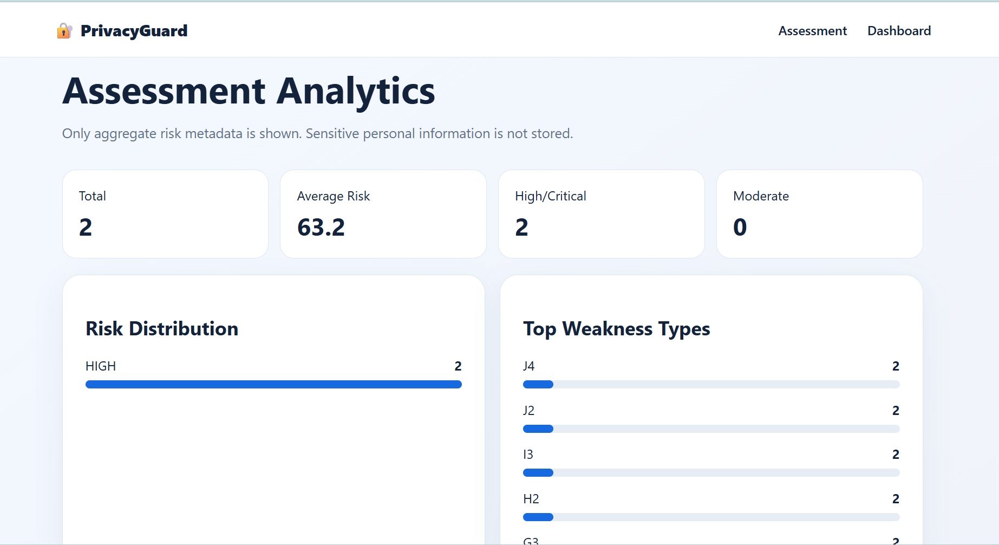

# Social Media Privacy Risk Assessment Framework

A defensive cybersecurity and privacy-awareness project that evaluates self-reported social-media privacy practices and produces a transparent 0–100 risk score, category analysis, findings, recommendations, an improvement simulation, dashboard analytics, and a printable report.

> **Ethical scope:** This project uses synthetic or voluntarily provided assessment responses. It does not scrape, track, enumerate, or profile real social-media users and does not request actual phone numbers, addresses, passwords, or private messages.

## Features
- 44-question privacy assessment
- 10 risk categories
- Configurable weighted 0–100 risk model
- LOW / MODERATE / HIGH / CRITICAL classification
- Findings and personalized remediation guidance
- Privacy improvement simulator
- Privacy-safe SQLite analytics
- Synthetic 1,000-record dataset generator
- Dashboard with risk distribution and common weaknesses
- Printable HTML report / browser Save as PDF
- Automated pytest tests

## Technology Stack
- Python + Flask
- SQLite
- HTML, CSS, JavaScript
- pytest

## Risk Model
The framework follows the project specification's educational weights: Profile 10%, Personal Information 15%, Location 15%, Content 10%, Connections 10%, Tagging 5%, Account Security 15%, Third-Party Apps 5%, Social Engineering 10%, Digital Footprint 5%. Higher score means higher assessed exposure. Thresholds: 0–20 LOW, 21–40 MODERATE, 41–70 HIGH, 71–100 CRITICAL.

These weights and thresholds are educational assumptions and should be calibrated before professional use.

## Run locally (Windows PowerShell)
```powershell
cd Social-Media-Privacy-Risk-Assessment
python -m venv .venv
.venv\Scripts\Activate.ps1
pip install -r requirements.txt
python data\generate_dataset.py
python backend\app.py
```
Open: `http://127.0.0.1:5000`

Dashboard: `http://127.0.0.1:5000/dashboard`

## Tests
```powershell
pytest -q
```

## API
- `POST /api/assessment`
- `GET /api/assessment/{id}`
- `GET /api/assessment/{id}/recommendations`
- `POST /api/assessment/simulate-improvement`
- `GET /api/dashboard/stats`
- `GET /api/privacy-checklist`
- `GET /api/report/{id}`

## Database Privacy
The SQLite database stores assessment ID, overall score, risk level, category scores, finding types/severity/descriptions, recommendation metadata, and timestamps. It intentionally does not store raw answers, phone numbers, emails, addresses, birth dates, passwords, exact locations, or private messages.

## Project Structure
```text
backend/
  app.py
  services/
    assessment_engine.py
    database.py
frontend/
  index.html
  dashboard.html
  report.html
  css/
  js/
data/
tests/
docs/
reports/
screenshots/
```

## 📸 Screenshots

The project includes screenshots demonstrating the main features:

### Privacy Risk Assessment Report



### Privacy Findings & Checklist



### Improvement Simulator



### Privacy Analytics Dashboard



## Future Improvements
Platform-specific privacy checklists, privacy maturity scoring, awareness quizzes, enterprise training, GRC reporting, better score calibration, localization, accessibility, comparison over time, and optional local-only assessment mode.

## Author
Student cybersecurity project — Social Media Privacy Risk Assessment Framework.
